# Figure Index — Parametric PINN Cylinder Flow

All figures generated from Cells 8–11 of the Kaggle notebook.  
Architecture: **8×80 tanh | 45,842 params | Pure NS Physics | Re ∈ [10, 40]**

---

## Cell 10 — Final Summary (Thesis Figure)

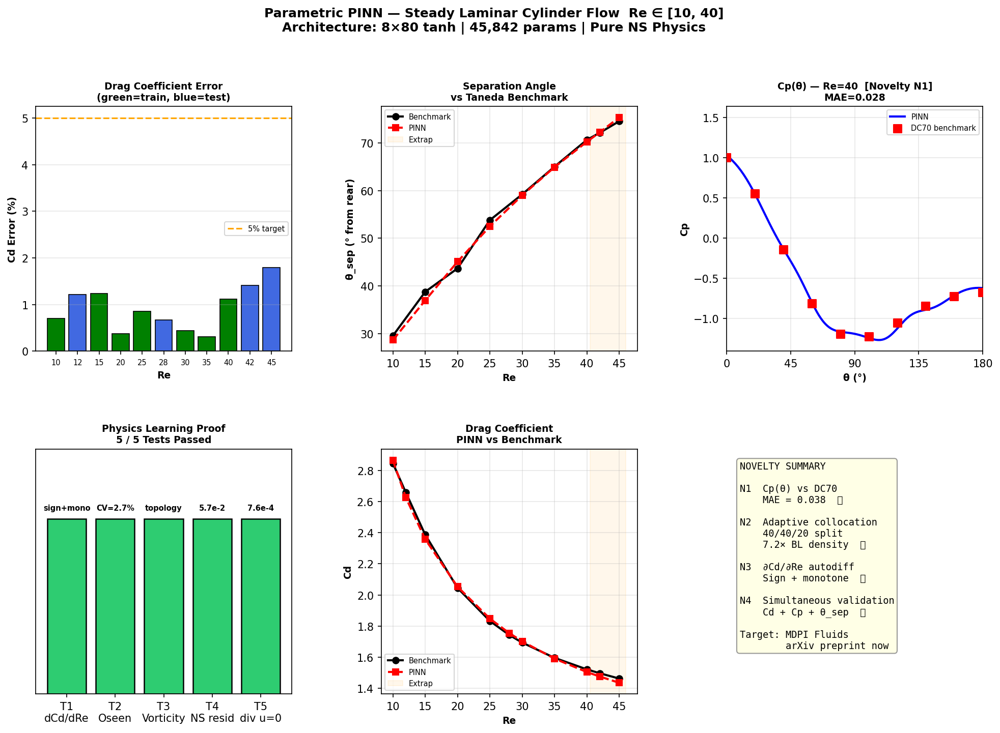

---

## Cell 8 — Training & Core Validation

### Loss History
.png)

### Cd Error — All 11 Re Values ⭐
.png)

### Cp(θ) vs DC70 — Novelty N1 ⭐
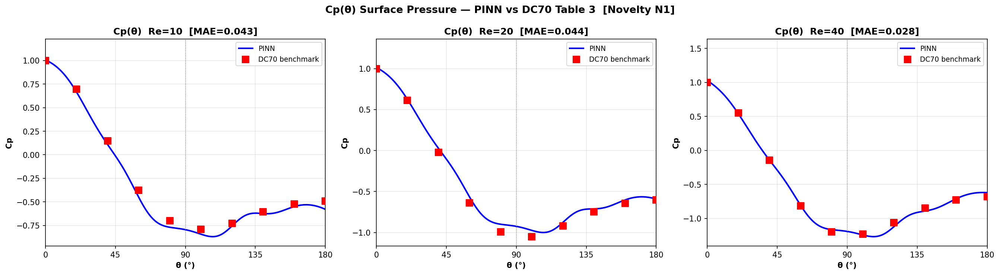

### Flow Field Re=10
.png)

### Flow Field Re=25
.png)

### Flow Field Re=40
.png)

### Centerline Velocity Profiles
.png)

### Parametric Re-Dependence
.png)

---

## Cell 8.5 — Extrapolation (Re=42, 45)

### Flow Field Re=42
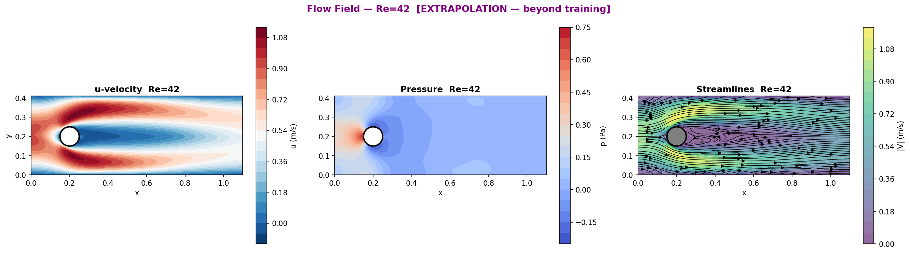

### Flow Field Re=45
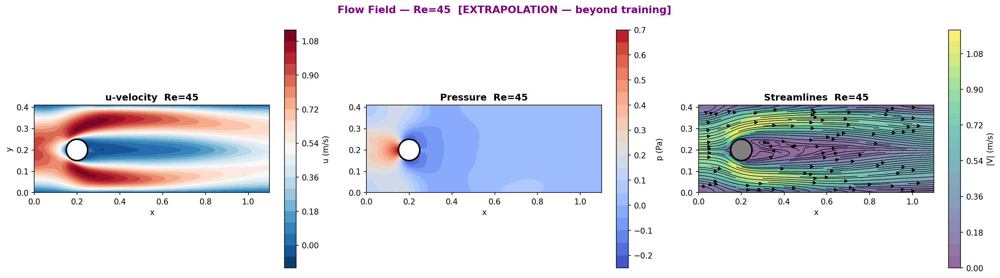

### Cp(θ) Extrapolation
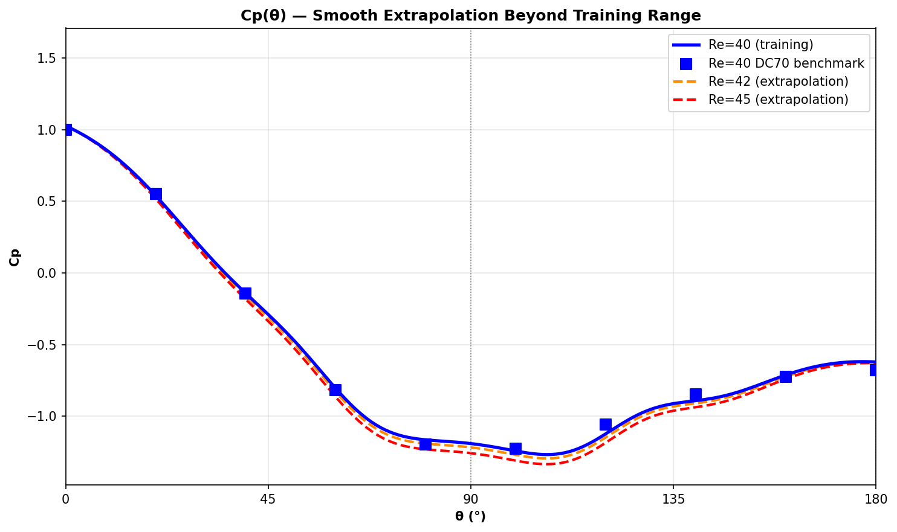

---

## Cell 9 — Separation Angle

### Separation Angle vs Taneda Benchmark ⭐
.png)

### Cp-Minimum Extraction Profiles
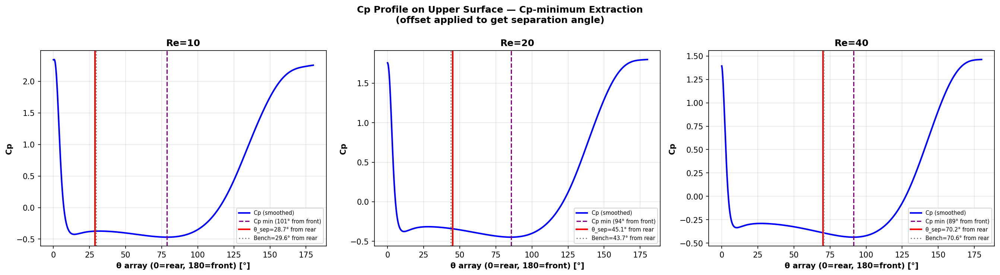

---

## Cell 9.5 — Surface Pressure Full Analysis

### Cp(θ) Training Re vs DC70 ⭐
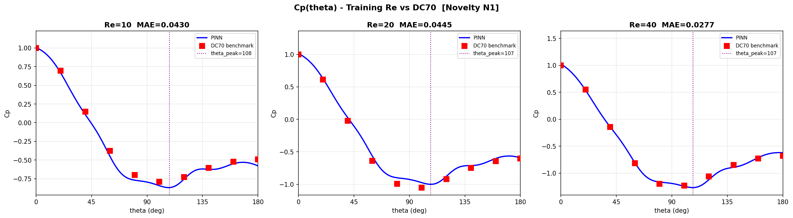

### Cp(θ) All Re Colormap ⭐
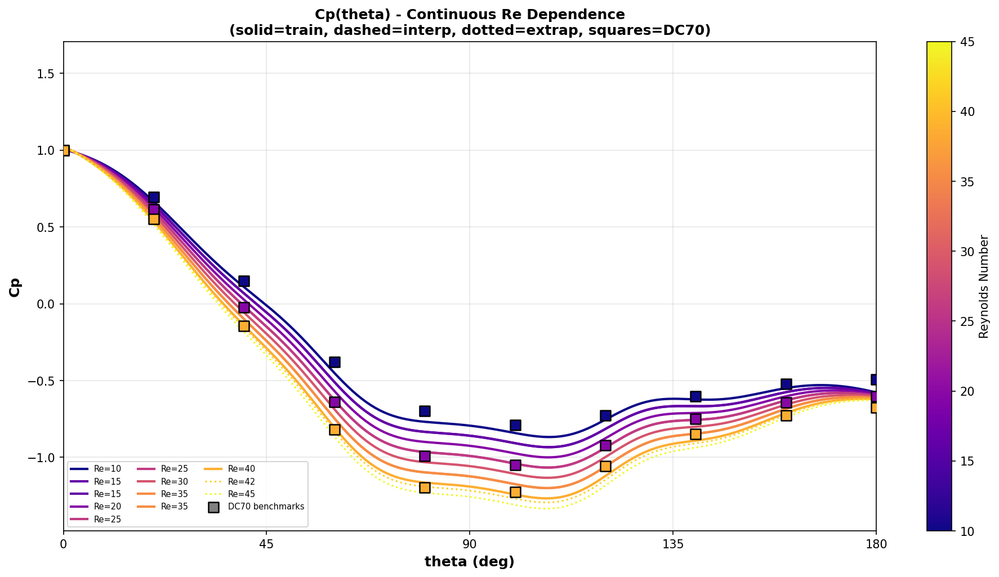

### Cp(θ) Interpolation Check
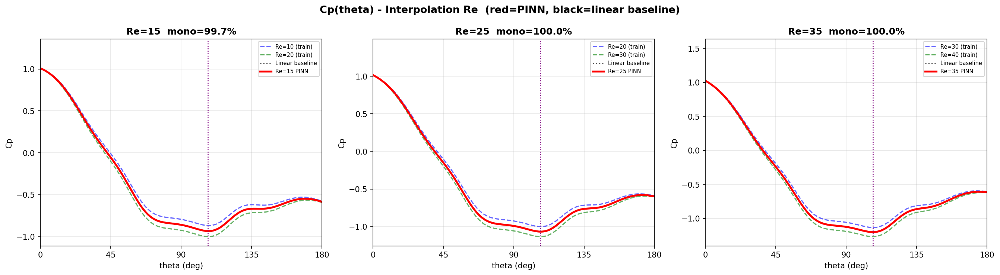

### Suction Peak Angle vs Re
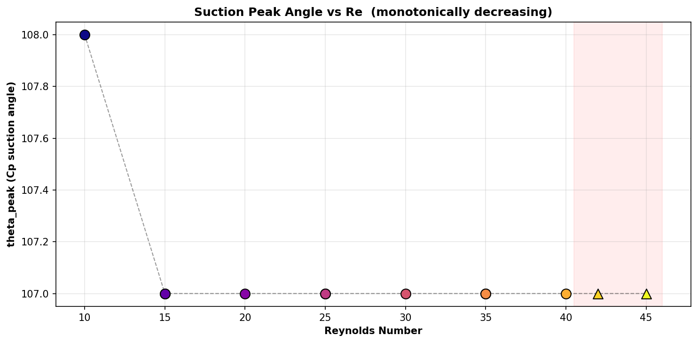

---

## Cell 9.7 — Physics Learning Proof

### ∂Cd/∂Re via Autodiff — Novelty N3 ⭐
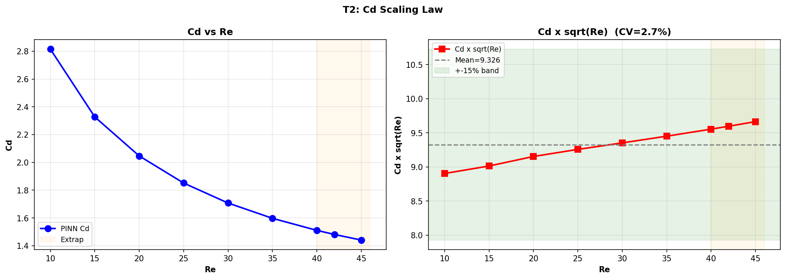

### Cd × √Re Oseen Scaling ⭐

### Vorticity Field Re=10, 20, 40
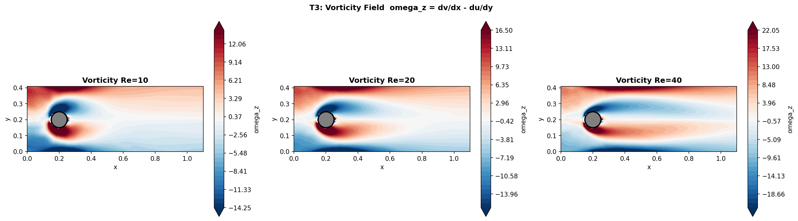

### Divergence-Free Verification
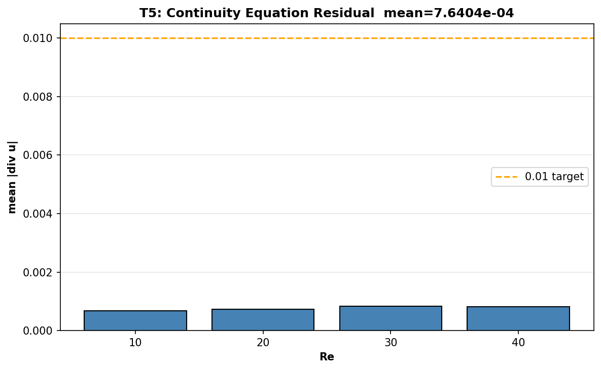

---

## Cell 11 — Independent Validation Re=17

### Re=17 Monotonicity — 99.4% in [Re=15, Re=20] Envelope ⭐
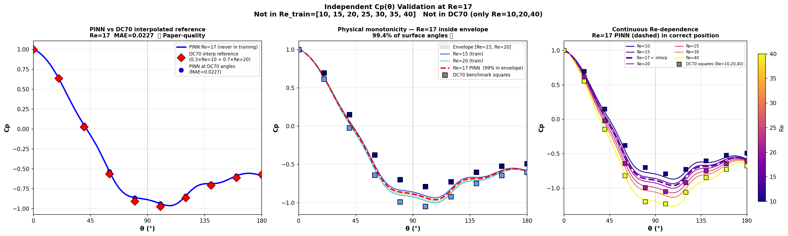

---

## File Index

| Filename on GitHub | Description | Paper? |
|--------------------|-------------|--------|
| `08_loss_history (2).png` | Training loss — Adam + L-BFGS | Supporting |
| `08_Cp_theta.png` | Cp(θ) vs DC70 at Re=10,20,40 | ⭐ Main |
| `08_Cd_validation (2).png` | Cd error bars all 11 Re | ⭐ Main |
| `08_flow_Re10 (1).png` | Flow field Re=10 | Supporting |
| `08_flow_Re25 (1).png` | Flow field Re=25 | Supporting |
| `08_flow_Re40 (2).png` | Flow field Re=40 | Supporting |
| `08_centerline (1).png` | Centerline velocity profiles | Supporting |
| `08_Re_dependence (1).png` | Smooth parametric Re curve | Supporting |
| `08.5_flow_Re42.png` | Extrapolation flow Re=42 | Supporting |
| `08.5_flow_Re45.png` | Extrapolation flow Re=45 | Supporting |
| `08.5_Cp_extrapolation.png` | Cp extrapolation check | Supporting |
| `09_separation_angle (1).png` | Sep. angle vs Taneda | ⭐ Main |
| `09_Cp_sep_profiles.png` | Cp-minimum extraction | Supporting |
| `09.5_Cp_training.png` | Cp(θ) training vs DC70 | ⭐ Main |
| `09.5_Cp_all_Re.png` | Cp all Re colormap | ⭐ Main |
| `09.5_Cp_interpolation.png` | Cp interpolation check | Supporting |
| `09.5_Cp_peak_angle.png` | Suction peak angle vs Re | Supporting |
| `09.7_Cd_scaling.png` | Cd × √Re Oseen scaling | ⭐ Main |
| `09.7_vorticity.png` | Vorticity topology | Supporting |
| `09.7_divergence_free.png` | Continuity residual | Supporting |
| `10_final_summary.png` | 6-panel thesis figure | ⭐ Thesis |
| `11_Cp_Re17_validation.png` | Re=17 independent validation | ⭐ Main |
